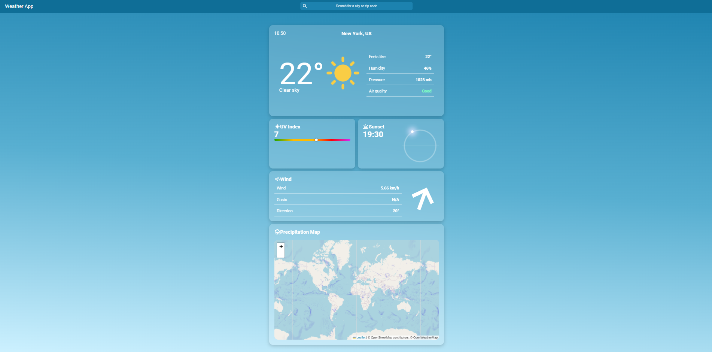

# Weather App
This is a simple weather web application that shows current weather built with HTML, CSS, and JavaScript. It uses data from OpenWeatherMap and Open-Meteo.


## Features

 - Search weather by city or use geolocation
 - Air Quality Index with color-coded status
 - UV Index gauge with real-time positioning  
 - Sunrise and sunset visualization with a rotating sun circle
 - Precipitation Map
 - **Dynamic backgrounds:** a background color theme for day, clouds, night and sunset
 

## Tech Stack

 - HTML, CSS, JavaScript
 - [OpenWeatherMap](https://openweathermap.org/api)
 - [Open-Meteo](https://open-meteo.com/)
 - Leaflet.js
 - Google Icons
 

## Installation
1. Clone the repo:
```bash
git clone https://github.com/chlebaq/weather-app.git
```
2. Navigate to the project directory:
```bash
cd weather-app
```
3. Put your OpenWeather API key inside the script:
```javascript
const apiKey = "your_api_key";
```
4. Open `index.html` in your browser.
